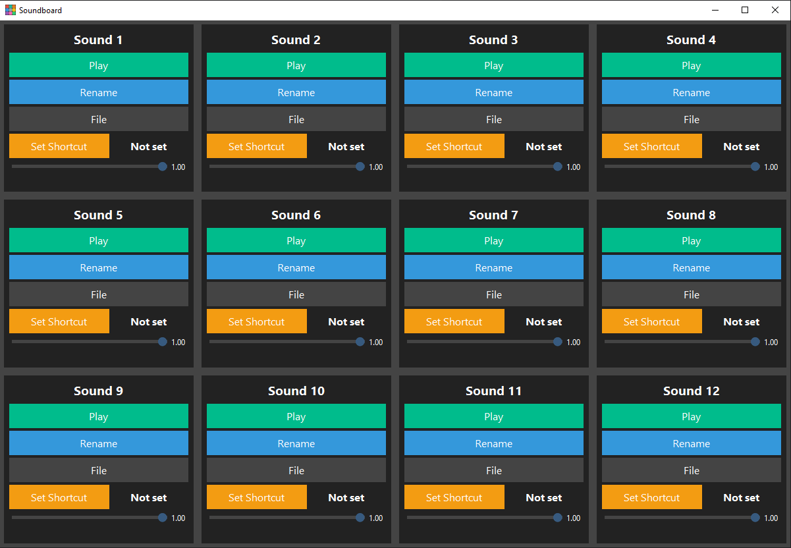
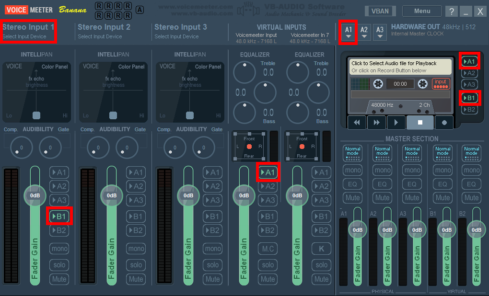

# Soundboard

## Description
**Soundboard** is a lightweight Windows soundboard application designed to play audio files through  
**Voicemeeter Banana**.

It is built to be simple, practical, and easy to configure for everyday use such as streaming, voice chat, or recording.  
Each sound button can have its own audio file, volume level, and optional global hotkey.

---

## Preview
An example of the Soundboard interface:

---

## Features
- Grid-based soundboard with customizable button names
- Support for `.wav`, `.mp3`, and `.ogg` audio files
- Per-sound volume control
- Global keyboard shortcuts
- System tray support (minimize to tray)
- Voicemeeter Banana integration
- Automatic configuration saving

---

## Requirements
- **Windows**
- **Voicemeeter Banana (64-bit)**

Download Voicemeeter Banana here:  
https://vb-audio.com/Voicemeeter/banana.htm

---

## Installation
1. [Download](https://vb-audio.com/Voicemeeter/banana.htm) and install **Voicemeeter Banana**  
   Make sure it starts correctly at least once.
2. [Download](https://github.com/Magnorbis/soundboard/releases) and run the **Soundboard installer**.
3. Launch Soundboard.
4. Assign audio files to the buttons.
5. Adjust volumes and set optional keyboard shortcuts.
6. Ensure **Voicemeeter Banana is running** before playing sounds.

> On first launch, Soundboard will automatically create its configuration file.

---

## Example Voicemeeter Banana Setup
Below is an **example configuration** that works well with Soundboard.  
Your setup may differ depending on your hardware and use case.

### Voicemeeter Settings
- **Hardware Out**
  - A1: Your main output device (headset or speakers)

- **Stereo Input 1**
  - Select your microphone
  - Enable **B1**

- **Virtual Input (Voicemeeter Input)**
  - Enable **A1**

- **Recorder**
  - Enable **A1**
  - Enable **B1**

### Windows Sound Settings
- **Default Input:** `Voicemeeter Out B1`
- **Default Output:** `Voicemeeter Input`

> You can disable unused Voicemeeter inputs/outputs if you want a cleaner setup.

---

## Support / Donations
If you enjoy this project and want to support it, you can leave a small donation here:  
https://ko-fi.com/magnorbis

---

## Project Notes
- This project was created in **about 2 days**
- There are **no plans for active long-term development**
- If a **serious bug** is found, I may revisit and fix it
- Feel free to **use, modify, or learn from the code** however you like

---

## License
No formal license.  
Use the code freely at your own discretion.
